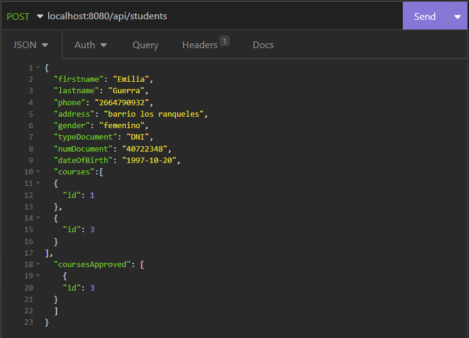
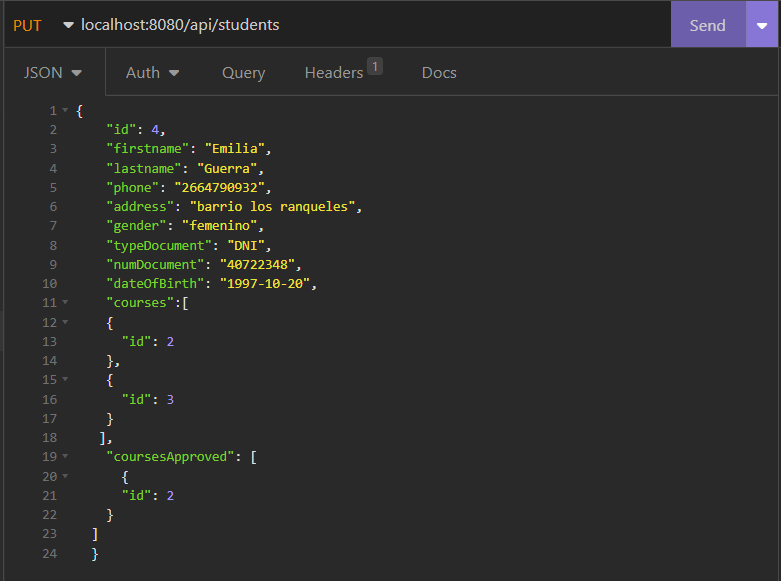
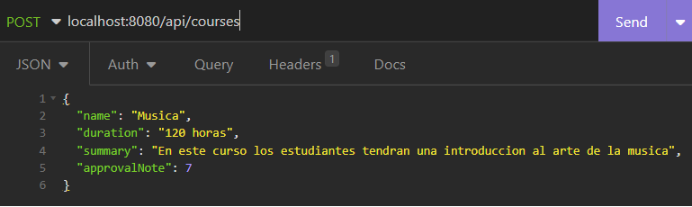
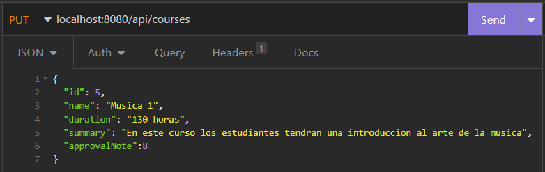
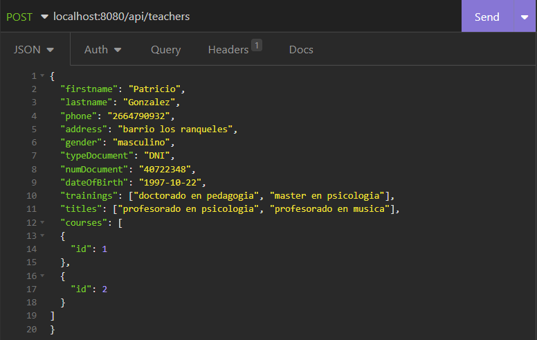
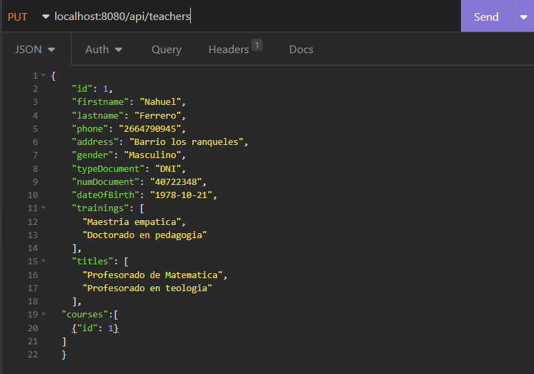

# Examen de Spring Boot
Proyecto spring boot con las dependencias/starters:
* Spring Data Jpa
* Hibernate
* Spring web
* Spring Boot Devtools
* Validation
* PostgreSQL

Aplicacion API REST con acceso a base de datos PostgreSQL para persistir la información.

El proyecto puede inicializarse desde ExamenStacktraceApplication.java corriendo la aplicacion(desde Intellij IDEA se clickea el boton RUN y el servidor estara levantado en el puerto 8080)

## Entidad Student(Alumno)
* Student
* StudentRepository
* StudentController
* StudentService
* StudentServiceImpl

## Entidad Teacher(Profesor)
* Teacher
* TeacherRepository
* TeacherController
* TeacherService
* TeacherServiceImpl

## Entidad Course(Curso/Materia)
* Course
* CourseRepository
* CourseController
* CourseService
* CourseServiceImpl

## Rutas de Student(Alumnos)

* Obtener la lista de todos los alumnos de la institución. (metodo GET localhost:8080/api/students)

* Obtener la lista de cursos a los cuales concurre un alumno determinado. (metodo GET localhost:8080/api/students/{id del alumno}/courses)

* Obtener la lista de cursos aprobados de un alumno determinado. (metodo GET localhost:8080/api/students/{id del alumno}/approved)

* Obtener un alumno por id (metodo GET localhost:8080/api/students/{id del alumno})

* Dar de alta un alumno (metodo POST localhost:8080/api/students)

* Modificacion de un alumno (metodo PUT localhost:8080/api/students)

* Borrado de un alumno (metodo DELETE localhost:8080/api/students/{id del alumno})

## Rutas Course(Cursos/Materias)

* Obtener la lista de todos los cursos. (metodo GET localhost:8080/api/courses)

* Obtener la lista de todos los alumnos que concurren un curso determinado. (metodo GET localhost:8080/api/courses/{id del curso}/students)

* Obtener la lista de alumnos aprobados de un curso determinado. (metodo GET localhost:8080/courses/{id del curso}/approved)

* Obtener un curso por id (metodo GET localhost:8080/api/courses/{id del curso})

* Dar de alta un curso. Se debe enviar por body toda la informacion del curso (metodo POST localhost:8080/api/courses)

* Modificacion de un curso (metodo PUT localhost:8080/api/courses)

* Borrado de un curso (metodo DELETE localhost:8080/api/courses/{id del curso})

## Rutas Teacher(Profesor)
* Obtener la lista de todos los profesores. (metodo GET localhost:8080/api/teachers)

* Obtener la lista de todos los cursos que dicta un profesor determinado. (metodo GET localhost:8080/api/teachers/{id del profesor}/courses)

* Obtener un profesor por id (metodo GET localhost:8080/api/teachers/{id del profesor})

* Dar de alta un profesor (metodo POST localhost:8080/api/teachers)

* Modificacion de un curso (metodo PUT localhost:8080/api/teachers)

* Borrado de un curso (metodo DELETE localhost:8080/api/teachers/{id del profesor})